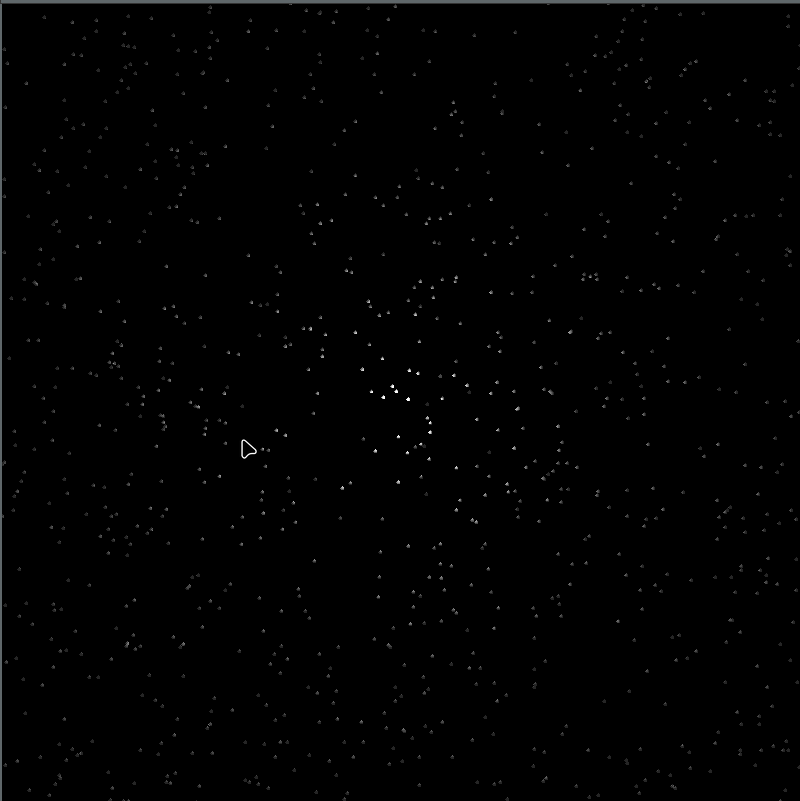
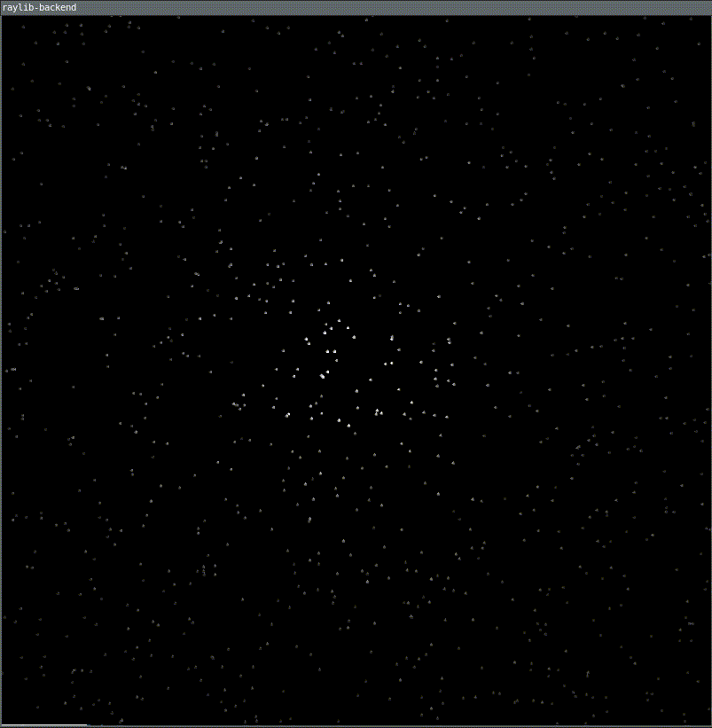

# Peak
Peak is a screen capture application for **linux**, and only **linux**. 
its intended to replace peek, for my use, trying to fix the low fps problem i get when recording my gifs.

- why not cross platform:    
i dont care, and i like the small codebase all the code is in the main.c and make_gif.sh files, not like peek source code where there are ton of files to see and go through

## Output Comparison
### Peek
        
 
### Peak
    